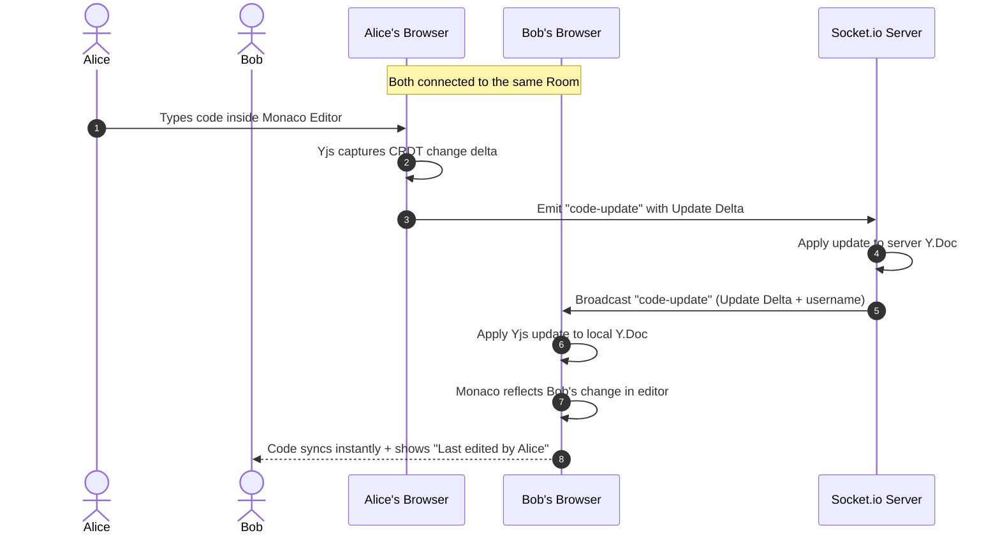
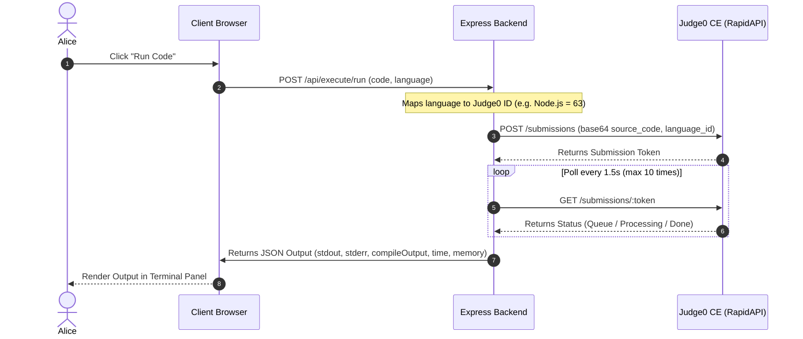
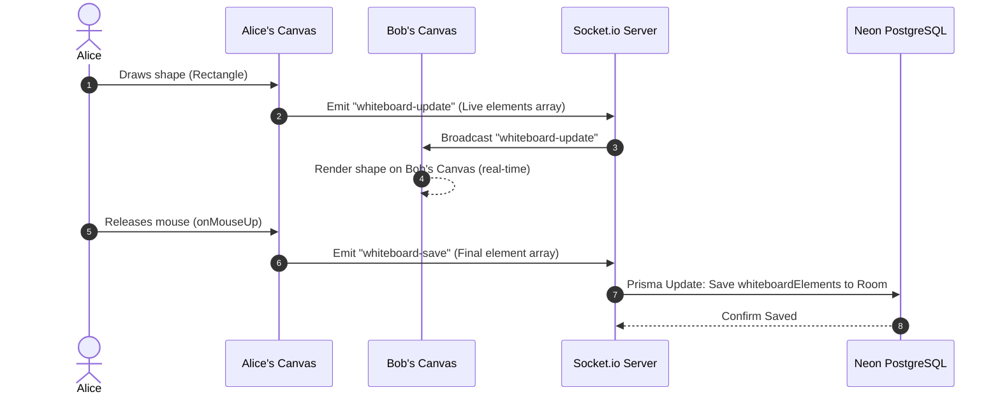
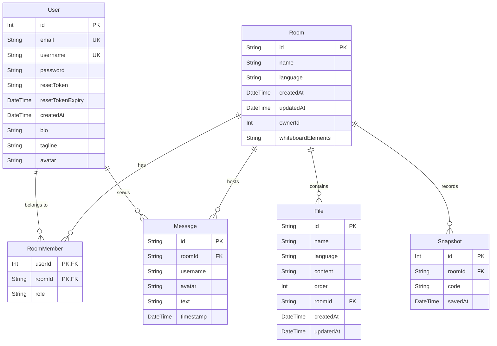

<div align="center">

```
 ██████╗ ██████╗ ██████╗ ███████╗ ██████╗ ██████╗ ██╗     ██╗      █████╗ ██████╗ 
██╔════╝██╔═══██╗██╔══██╗██╔════╝██╔════╝██╔═══██╗██║     ██║     ██╔══██╗██╔══██╗
██║     ██║   ██║██║  ██║█████╗  ██║     ██║   ██║██║     ██║     ███████║██████╔╝
██║     ██║   ██║██║  ██║██╔══╝  ██║     ██║   ██║██║     ██║     ██╔══██║██╔══██╗
╚██████╗╚██████╔╝██████╔╝███████╗╚██████╗╚██████╔╝███████╗███████╗██║  ██║██████╔╝
 ╚═════╝ ╚═════╝ ╚═════╝ ╚══════╝ ╚═════╝ ╚═════╝ ╚══════╝╚══════╝╚═╝  ╚═╝╚═════╝ 
```

**A real-time collaborative coding platform for developers.**  
Write, run, and discuss code together — powered by AI and drawing canvases.

[](https://nodejs.org)
[](https://react.dev)
[](https://neon.tech)
[](https://prisma.io)
[](https://socket.io)

[Features](#-features) · [Tech Stack](#-tech-stack) · [Process Flows](#-process-flows) · [Project Structure](#-project-structure) · [Database Schema](#-database-schema) · [API Reference](#-api-reference) · [Environment Variables](#-environment-variables)

</div>

---

## ✨ Features

- **Real-time Collaborative Editing** — Conflict-free synchronized typing across tabs using Yjs CRDTs and Monaco Editor over Socket.io.
- **Collaborative Darkboard** — An infinite brainstorming canvas with a grid background. Draw freehand paths, rectangles, circles, lines, and edit text blocks in real-time. Features zoom controls, canvas panning, and remote mouse cursors with labeled usernames.
- **WebRTC Voice & Video Calls** — A floating, resizable, and draggable overlay window for team calling. Supports camera/mic toggling, local mirroring, participant indicators, and double-click pinning for focus speaker views.
- **AI Pair Programmer & Code Reviewer** — Segmented AI panel supporting general chat, context-aware query questions, and an **AI Code Reviewer** that scans active files, highlights line-by-line lint violations, and generates refactored improvements that can be applied to Monaco with one click.
- **Command Palette (`Ctrl+Shift+P`)** — A blurred glassmorphic command search bar to run code, save snapshots, export ZIPs, toggle panels, switch themes, or update language settings using keyboard shortcuts.
- **Live Code Execution** — Run code in 8+ languages directly in the browser via Judge0 CE. Results broadcast to all room members.
- **Theme Selection Selector** — Independently switch code editor themes (VS Dark, VS Light, Dracula, Monokai, One Dark Pro). The Darkboard automatically synchronizes its canvas background, toolbar borders, and neon palettes to fit the selected theme.
- **Multi-file Workspace** — Create, rename, delete, and switch between multiple files. Tabs automatically close upon file deletion.
- **Team Chat** — Real-time chat panel persisted to the database. Displays formatted timestamps and user avatars.
- **JWT Auth & OAuth** — Secure email/password login alongside a premium, full-width "Continue with Google" OAuth button. Inputs use animated floating labels and include real-time password strength checking.

---

## 🛠 Tech Stack

### Frontend
- **React 19 + Vite** — High-performance SPA framework and bundler.
- **Monaco Editor** — VS Code-grade code editor with syntax highlighting, auto-completion, and theme registries.
- **Yjs & Y-Monaco** — High-performance CRDT library for editing sync.
- **Socket.io Client** — Bidirectional real-time event communication.
- **Framer Motion** — Premium fluid layout and component animations.
- **Axios** — HTTP client with auth interceptors.

### Backend
- **Node.js + Express** — REST API server.
- **Socket.io Server** — WebSocket synchronization engine.
- **Prisma ORM v6** — Type-safe relational database access.
- **PostgreSQL (Neon)** — Serverless cloud database.
- **Groq SDK** — Streaming AI completion endpoint (Llama 3 models).

---

## 📡 Process Flows

### 1. Code Collaboration Flow (Yjs CRDT)


### 2. Live Code Execution Flow (Judge0 CE)


### 3. WebRTC Call Connection Flow
```mermaid
sequenceDiagram
    autonumber
    actor Alice
    actor Bob
    participant ClientAlice as Alice's Client
    participant ClientBob as Bob's Client
    participant Server as Socket.io Signaling
    
    Alice->>ClientAlice: Clicks "Join Call"
    ClientAlice->>Server: Emit "join-call"
    Server->>ClientBob: Broadcast "user-joined-call" (Alice details)
    Server-->>ClientAlice: Emit "call-users" (Bob details)
    Note over ClientAlice: Initiates WebRTC Connection
    ClientAlice->>Server: Emit "webrtc-signal" (Offer SDP) to Bob
    Server->>ClientBob: Forward "webrtc-signal" (Offer SDP)
    ClientBob->>Server: Emit "webrtc-signal" (Answer SDP) to Alice
    Server->>ClientAlice: Forward "webrtc-signal" (Answer SDP)
    Note over ClientAlice, ClientBob: Peer-to-Peer connection established via STUN
    ClientAlice<-->>ClientBob: Direct P2P Video/Audio stream exchange
```

### 4. Real-time Darkboard Sync Flow


---

## 📁 Project Structure

```
codecollab/
│
├── server/                         # Node.js backend
│   ├── prisma/
│   │   └── schema.prisma           # Database schema
│   ├── src/
│   │   ├── config/
│   │   │   └── passport.js         # Google OAuth Strategy
│   │   ├── controllers/
│   │   │   ├── aiController.js     # Groq streaming code reviews
│   │   │   ├── authController.js   # Auth routes controller
│   │   │   ├── executeController.js # Judge0 code execution
│   │   │   ├── fileController.js   # Multi-file management
│   │   │   └── roomController.js   # Room database utilities
│   │   ├── middleware/
│   │   │   └── auth.middleware.js  # JWT token validation
│   │   ├── routes/
│   │   │   ├── ai.routes.js
│   │   │   ├── auth.routes.js
│   │   │   ├── execute.routes.js
│   │   │   ├── file.routes.js
│   │   │   └── room.routes.js
│   │   ├── ws/
│   │   │   └── collaboration.js    # Socket.io sync, WebRTC signal & Darkboard
│   │   ├── prismaClient.js
│   │   └── index.js                # App entry point
│   ├── .env
│   └── package.json
│
└── client/                         # React frontend
    ├── src/
    │   ├── components/
    │   │   ├── AIPanel.jsx         # Chat, Ask AI, and AI Review tabs
    │   │   ├── CommandPalette.jsx  # blurred palette dialog
    │   │   ├── FileTree.jsx        # Sidebar explorer files
    │   │   ├── Logo.jsx
    │   │   ├── TerminalPanel.jsx   # Console log & compilation logs
    │   │   └── Whiteboard.jsx      # Infinite collaborative Darkboard
    │   ├── context/
    │   │   ├── AuthContext.jsx
    │   │   └── ThemeContext.jsx
    │   ├── hooks/
    │   │   ├── useAI.js
    │   │   ├── useCollaboration.js # Yjs syncing connection hook
    │   │   ├── useExecution.js     # code execution runner hook
    │   │   └── useWebRTC.js        # low level WebRTC connection hook
    │   ├── pages/
    │   │   ├── Dashboard.jsx       # Rooms list + Recent activity sidebar
    │   │   ├── EditorRoom.jsx      # Main editor workspace & call panels
    │   │   ├── LandingPage.jsx     # Product presentation & live preview
    │   │   ├── LoginPage.jsx       # Animated floating login page
    │   │   ├── OAuthCallback.jsx   # OAuth redirect handler
    │   │   ├── ProfilePage.jsx     # Profile configurations
    │   │   └── RegisterPage.jsx    # Strength check registration page
    │   ├── App.jsx                 # Routes
    │   ├── index.css               # Main styling rules
    │   └── main.jsx
    ├── .env
    └── package.json
```

---

## 🗄 Database Schema



| Model | Description |
|---|---|
| `User` | User details, biographics, avatars, and credentials. |
| `Room` | Active room details, settings, and the saved `whiteboardElements` JSON string. |
| `File` | Code files matching language highlighting. |
| `RoomMember` | Linking table mapping users inside a room to their role (editor or host). |
| `Message` | Chat messages exchanged inside the room. |
| `Snapshot` | Saved checkpoint files for backup history. |

---

## 📡 API Reference

### Auth
| Method | Endpoint | Description | Auth |
|---|---|---|---|
| `POST` | `/api/auth/register` | Create a new account | ❌ |
| `POST` | `/api/auth/login` | Sign in | ❌ |
| `POST` | `/api/auth/logout` | Sign out + clear cookies | ❌ |
| `POST` | `/api/auth/google` | Trigger Google OAuth callback | ❌ |
| `POST` | `/api/auth/forgot-password` | Request password reset | ❌ |
| `POST` | `/api/auth/reset-password` | Reset password with token | ❌ |
| `GET` | `/api/auth/me` | Get current user profile | ✅ |

### Rooms
| Method | Endpoint | Description | Auth |
|---|---|---|---|
| `POST` | `/api/rooms/create` | Create a room | ✅ |
| `GET` | `/api/rooms/my` | Get user's active rooms | ✅ |
| `GET` | `/api/rooms/recent-activity` | Fetch recent file and room activities | ✅ |
| `GET` | `/api/rooms/:roomId` | Get room data by ID | ✅ |
| `PATCH` | `/api/rooms/:roomId/rename` | Rename room title | ✅ |
| `DELETE` | `/api/rooms/:roomId` | Delete room and nested assets | ✅ |

### Files
| Method | Endpoint | Description | Auth |
|---|---|---|---|
| `POST` | `/api/files/create` | Create a new file | ✅ |
| `PUT` | `/api/files/:fileId` | Save file content modifications | ✅ |
| `DELETE` | `/api/files/:fileId` | Delete a file | ✅ |

### AI & Code Execution
| Method | Endpoint | Description | Auth |
|---|---|---|---|
| `POST` | `/api/ai/ask` | Stream chat query answers | ✅ |
| `POST` | `/api/ai/complete` | Autocomplete ghost suggestion provider | ✅ |
| `POST` | `/api/ai/review` | Generate file lint issues and code fixes | ✅ |
| `POST` | `/api/execute/run` | Execute source code via Judge0 CE | ✅ |

---

## 🔌 Socket Events

### Client → Server
| Event | Payload | Description |
|---|---|---|
| `join-room` | `{ roomId, username, avatar }` | Joins a room, triggers initial history load. |
| `code-update` | `{ roomId, update }` | Syncs Yjs CRDT edit deltas. |
| `cursor-update` | `{ roomId, cursor }` | Broadcasts editor cursor position. |
| `chat-message` | `{ roomId, message, username, avatar }` | Saves and broadcasts chat messages. |
| `join-call` | `{ roomId, username, avatar }` | Registers peer inside WebRTC room group. |
| `leave-call` | `{ roomId }` | Disconnects peer from active call group. |
| `webrtc-signal` | `{ to, signal }` | Sends ICE candidate/SDP offer to a target peer. |
| `call-status-update` | `{ roomId, isMuted, isVideoOff }` | Syncs peer call status indicators. |
| `whiteboard-update` | `{ roomId, elements }` | Broadcasts live drawing coordinates. |
| `whiteboard-save` | `{ roomId, elements }` | Saves final element shape details to DB. |
| `whiteboard-cursor` | `{ roomId, cursor }` | Share live whiteboard cursor locations. |
| `whiteboard-clear` | `{ roomId }` | Clears all elements from DB and canvas. |

### Server → Client
| Event | Payload | Description |
|---|---|---|
| `sync-state` | `Uint8Array` | Initial state vector for Yjs document. |
| `code-update` | `{ update, username }` | Broadcasts CRDT changes + active editor. |
| `room-users` | `Array` | Updated list of online users. |
| `initial-messages` | `Array` | Saved chat history sent upon join. |
| `chat-message` | `Message` | Broadcasts new chat message. |
| `active-call-users` | `Array` | Synchronized list of call participants. |
| `webrtc-signal` | `{ from, signal }` | Delivers WebRTC offer/answer SDP. |
| `call-status-update` | `{ socketId, isMuted, isVideoOff }` | Update peer status indicators. |
| `whiteboard-update` | `{ elements }` | Syncs canvas elements list. |
| `whiteboard-cursor` | `{ socketId, username, color, cursor }` | Renders peers drawing pointers. |
| `whiteboard-clear` | — | Resets drawing board to blank canvas. |

---

## 🔒 Environment Variables

### `server/.env`
| Variable | Required | Description |
|---|---|---|
| `DATABASE_URL` | ✅ | PostgreSQL connection string (from Neon.tech) |
| `JWT_SECRET` | ✅ | Secret for signing session JSON Web Tokens |
| `GROQ_API_KEY` | ✅ | Groq API Key (Llama 3 AI assistant) |
| `JUDGE0_API_KEY` | ✅ | RapidAPI key for hosted Judge0 CE services |
| `PORT` | ❌ | Server port (default: `5000`) |
| `CLIENT_URL` | ❌ | Frontend URL origin for CORS permissions |
| `GOOGLE_CLIENT_ID` | ❌ | Google Client ID for OAuth authentication |
| `GOOGLE_CLIENT_SECRET` | ❌ | Google Client Secret for OAuth authentication |
| `GOOGLE_CALLBACK_URL` | ❌ | Callback Redirect URI for Google logins |

### `client/.env`
| Variable | Required | Description |
|---|---|---|
| `VITE_API_URL` | ✅ | Base HTTP REST API URL (e.g. `http://localhost:5000/api`) |
| `VITE_SOCKET_URL` | ✅ | Socket.io server connection URL (e.g. `http://localhost:5000`) |


<div align="center">

Built with ❤️ by [subxm](https://github.com/subxm)

⭐ Star this repo if you found it useful!

</div>
